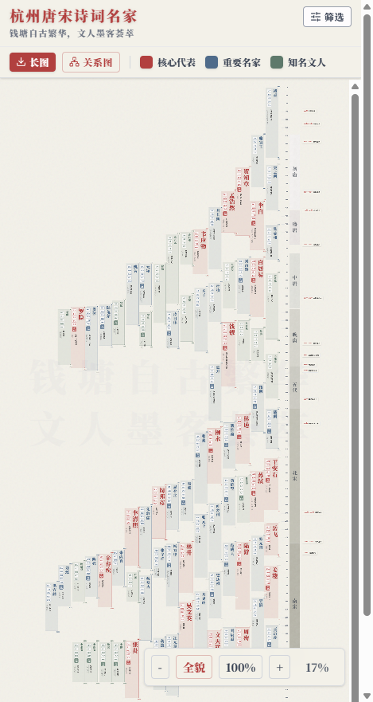

# 杭州唐宋诗词名家图鉴

> 钱塘自古繁华，文人墨客荟萃。

一个交互式的可视化应用，按时代纵向铺开 80+ 位与杭州相关的唐宋诗词名家，包含他们的生卒、流派、官职、代表作以及人物之间的关系网络。

🌐 **在线访问**：https://hangzhou-poets-ndlcm6zvaa.edgeone.cool

> 上面是腾讯云 EdgeOne Pages 的临时预览域名，正式域名待备案后绑定。

<p align="center">
  
</p>

<p align="center">
  <sub>↑ 移动端「全貌」视图：80+ 位诗人按时代纵向铺开；红 = 核心代表，蓝 = 重要名家，绿 = 知名文人。桌面端有更宽阔的卡片布局与详细筛选侧栏。</sub>
</p>

## 功能

- **时间轴主视图**：以年份为纵轴铺开所有诗人卡片，颜色区分核心/重要/知名三档；按"五代"等时期分块
- **人物详情**：点击卡片进入详情弹窗，含生平、流派、官职、代表作；移动端横排显示，桌面端竖排显示
- **关系网络**：单人关系图（围绕中心人物）+ 全景关系图（按时期分簇的力导向图）
- **多维筛选**：5 大类 30+ 个标签（文人类型 / 行迹 / 流派 / 科举 / 官职），支持多选 AND 过滤
- **导出长图**：一键导出整张时间轴为 PNG
- **Hash 路由**：`#/poet/<姓名>`、`#/graph`、`#/graph/<姓名>` 都能直接分享
- **响应式**：移动端紧凑顶栏 + 全屏筛选抽屉、自动 fit zoom、双指缩放；桌面端宽屏布局
- **数据自检**：构建前跑数据完整性校验（关系两端必须存在、生卒年逻辑、必填字段等）

## 技术栈

| 层 | 选型 |
|---|---|
| 框架 | React 19 + TypeScript |
| 构建 | Vite 6 |
| 样式 | Tailwind CSS 4 |
| 可视化 | D3.js（按子包：`d3-selection` / `d3-force` / `d3-zoom` / `d3-drag`） |
| 图标 | lucide-react |
| 部署 | 静态产物，托管在腾讯云 EdgeOne Pages |

## 本地运行

**前置条件**：Node.js ≥ 18

```bash
npm install
npm run dev          # http://localhost:3000
```

## 构建与部署

```bash
npm run validate:data    # 数据完整性校验（也会在 prebuild 阶段自动跑）
npm run build            # 输出到 dist/
npm run preview          # 本地预览 dist/
```

构建产物在 `dist/`，是纯静态文件（HTML + CSS + 分包 JS），可直接传到任意静态托管：EdgeOne Pages / Cloudflare Pages / Vercel / Netlify / 腾讯云 COS / GitHub Pages 都行。

### 部署到 EdgeOne Pages（手动 zip 模式）

> 注意：Windows PowerShell 的 `Compress-Archive` 会把内部路径写成反斜杠，EdgeOne 上传时会拒绝。请用 `.NET ZipArchive` 手动打包，确保路径用正斜杠：

```powershell
Add-Type -AssemblyName System.IO.Compression
Add-Type -AssemblyName System.IO.Compression.FileSystem
$distRoot = (Resolve-Path .\dist).Path
$zipPath = (Join-Path (Resolve-Path .).Path 'hangzhou-poets-dist.zip')
if (Test-Path $zipPath) { Remove-Item $zipPath -Force }
$fs = [System.IO.File]::Create($zipPath)
$zip = New-Object System.IO.Compression.ZipArchive($fs, [System.IO.Compression.ZipArchiveMode]::Create)
try {
  Get-ChildItem -Path $distRoot -Recurse -File | ForEach-Object {
    $rel = $_.FullName.Substring($distRoot.Length + 1).Replace('\','/')
    $entry = $zip.CreateEntry($rel, [System.IO.Compression.CompressionLevel]::Optimal)
    $es = $entry.Open(); $fs2 = [System.IO.File]::OpenRead($_.FullName)
    try { $fs2.CopyTo($es) } finally { $fs2.Close(); $es.Close() }
  }
} finally { $zip.Dispose(); $fs.Dispose() }
```

把生成的 `hangzhou-poets-dist.zip` 上传到 EdgeOne Pages 项目的「新建部署」即可。

## 项目结构

```
src/
├── App.tsx                  # 顶层布局、缩放/路由/触屏交互
├── main.tsx                 # 入口；启动时跑数据校验
├── components/
│   ├── Header.tsx           # 移动端紧凑顶栏 + 全屏筛选抽屉；桌面端宽栏
│   ├── TimelineBody.tsx     # 时间轴主体、十年分隔
│   ├── PoetCard.tsx         # 单张诗人卡片
│   ├── PoetDetailModal.tsx  # 详情弹窗（懒加载诗作内容）
│   ├── RelationshipGraph.tsx        # 单人关系图
│   └── GlobalRelationshipGraph.tsx  # 全景关系图
├── data/
│   ├── poets.ts             # 诗人列表（生卒、标签、官职等）
│   ├── relationships.ts     # 人物关系
│   ├── works.ts             # 代表作（懒加载）
│   └── validate.ts          # 数据校验
├── hooks/
│   └── useHashRoute.ts      # Hash 路由
├── constants/               # 时期定义、标签分组、缩放常量
├── types/                   # 类型定义
└── utils/                   # 布局计算、长图导出
```

## 数据来源

诗人生卒年、官职、流派、代表作主要参考《全唐诗》《全宋词》以及通行的人物年谱、地方志资料，关系网络以可考的师承、唱和、姻亲、同朝为依据，部分推断关系会标注存疑。

如发现数据错误欢迎提 Issue / PR。

## License

[Apache License 2.0](./LICENSE)

Copyright 2026 Lele Tang
